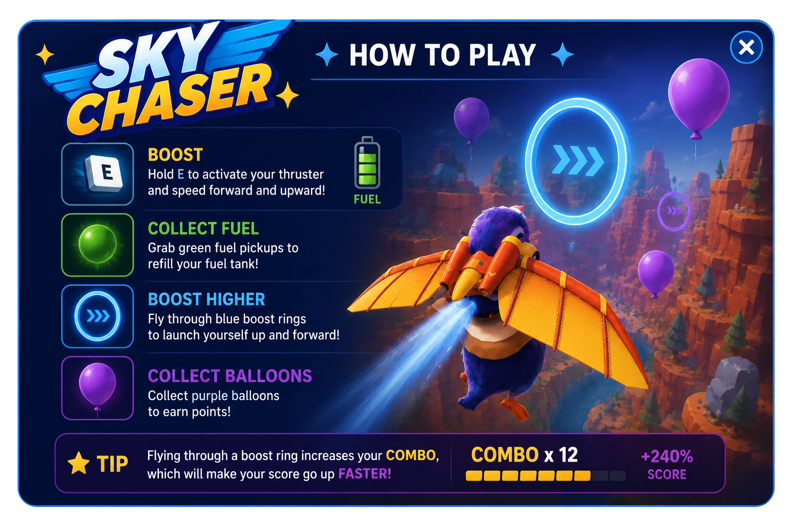

## `dcl-sky-chaser`

# Sky Chaser

Built for Decentraland SDK7 with the new Auth-Server, Sky Chaser is a multiplayer game where players compete to catch the most escaping packages per round. Includes Weekly and AllTime leaderboards.

### Play it here: [skychaser.dcl.eth](https://play.decentraland.org/?realm=skychaser.dcl.eth)

---

## Contents

- [Repository Overview](#repository-overview)
- [Getting Started](#getting-started)
  - [Pre-requisites](#pre-requisites)
  - [Preview the DCL scene](#preview-the-dcl-scene)
- [License](#license)

---

## Repository Overview

This repository is split in the following folders:

- `/assets` - contains all assets and textures before being exported to `glTF`. This includes all `blend` and `FBX` files, as well as full-size source textures.
  - `/assets/models` - source files for each model in the scene, including full res textures
  - `/assets/fonts` - any fonts used in the scene and accompanying media
  - `/assets/tex` - asset agnostic textures used across the scene
- `/config` - useful info such as import/export settings, UVPackMaster Presets, shader templates
- `/dcl` - the DCL scene to be deployed. Exported glTF files are in `/dcl/models` along with a `tex` folder of optimised textures
- `/docs` - extra info on relevant topics, eg asset creation
- `/reference` - screenshots, previs, reference pictures used during asset creation
- `/scripts` - various bash/blender/bat utility scripts

---

# Getting Started

## Pre-requisites

- **Previewing the scene**:

  - You will require the [Decentraland Creator Hub](https://decentraland.org/download/creator-hub/) to launch and host the scene.
  - You will require the [Decentraland Client](https://decentraland.org/download/) to join and view the scene.

## Preview the DCL scene

### First-time setup

1. Launch the Decentraland Creator Hub
1. Select the "Scenes" tab
1. Select "Import Scene"
1. Navigate to the repository folder and select the `dcl` folder inside it.

### Normal use

1. Launch the Decentraland Creator Hub
1. Select the scene from the home screen
1. Choose "Preview" at the top
1. This will fire up a local test server, and launch the Decentraland Client

---

## License

This work is licensed under the Creative Commons Attribution-NonCommercial-NoDerivatives 4.0 International License. To view a copy of this license, visit <http://creativecommons.org/licenses/by-nc-nd/4.0/>, see the license included in this repository, or send a letter to Creative Commons, PO Box 1866, Mountain View, CA 94042, USA.
